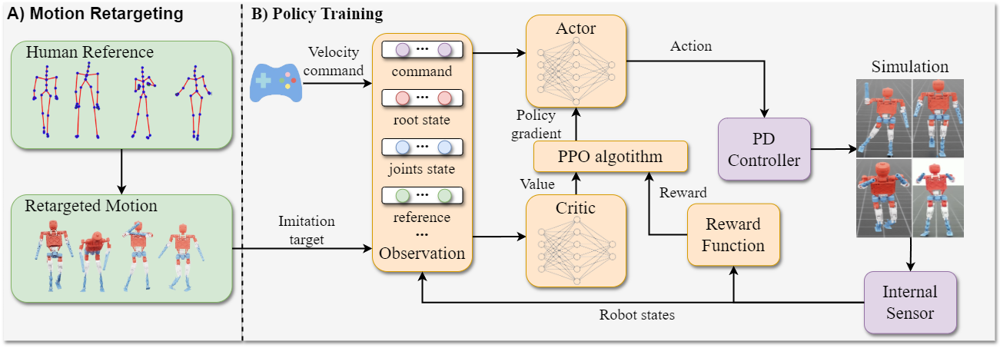
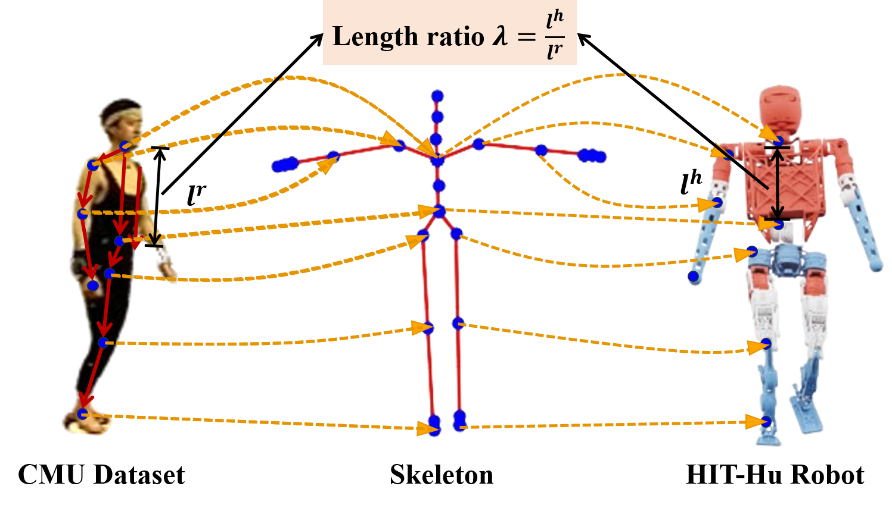
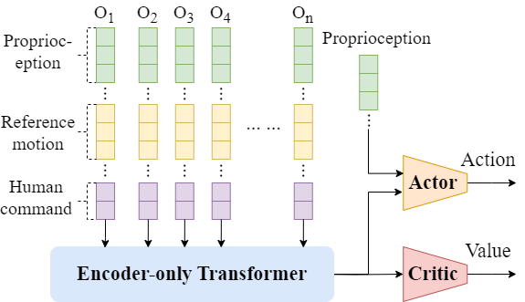
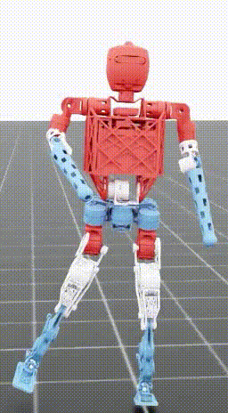
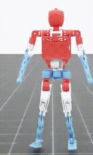
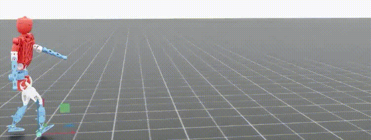
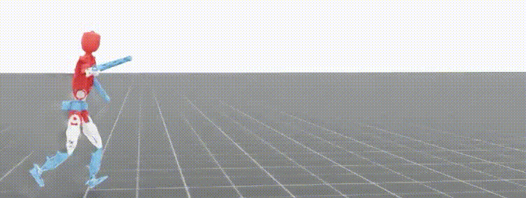

<h1 align="center">HumanDIL: Decouped Imitation for Whole-body   Humanoid Natural Locomotion</h1>

# Abstract
Humanoid robot control based on imitation learning has become a research hotspot for enhancing complex terrain locomotion capabilities due to its effectiveness in transferring human motion dexterity and adaptability. We proposes a novel imitation learning-based control framework called Human Decoupled Imitation Learning (HumanDIL). In it, a motion primitive reconstruction-based action redirection mechanism that extracts human "key skill set" and establishes a bipedal motion feature space, significantly improving data utilization and cross-terrain generalization in imitation learning. Then, a hierarchical control architecture where the lower body employs contact-aware end-to-end imitation learning for terrain-adaptive gait generation, while the upper body progressively enhances disturbance robustness through curriculum learning-guided impedance control. This framework strengthens posture coordination under dynamic disturbances through progressive complex terrain training. We evaluate HumanDIL on the HIT-Hu humanoid robot, validating its generalization capabilities and imitation performance across multiple tasks.

# Instruction

    

 Overview 

HumanDIL consists of two parts: 1) a motion retargeting algorithm to generate motion references, and 2) an imitation learning process that utilizes the retargeted motion data along with a decoupled reward function. HumanDIL combines end-to-end IL with curriculum learning in an upper-lower body decoupled control framework. Reward functions guide the upper and lower body separately, while curriculum learning progressively structures training from simple to complex tasks for coordinated whole-body motion.

  <figure style="display: inline-block; text-align: center; margin: 10px;">
    
    <figcaption>MU MoCap Motion Retargeted to HIT-Hu Robot.</figcaption>
  </figure>
  <figure style="display: inline-block; text-align: center; margin: 10px;">
    
    <figcaption>Humanoid imitation policy network.</figcaption>
  </figure>

# Overview

<table align="center">
  <tr>
    <td align="center">
       
      Wave
    </td>
    <td align="center">
       
      Pick.
    </td>
  </tr>
</table>

    

 Walk 

    

 Run 

    

 Traversing slope 

    

 Climbing stairs 

# Getting Start

1. Download Isaac Sim from the [website](https://developer.nvidia.com/isaac/sim) with vision >= 4.0.0, then follow the installation instructions.

2. Following the [instructions](https://docs.robotsfan.com/isaaclab/) to install Isaac Lab.

3. Once Isaac Lab is installed, install the external dependencies for this repo:
`pip install -r requirements.txt`

4. Install HIT_omniverse with pip by running:
`pip install -e .`

# License
This project is licensed under the MIT License. Note that the repository relies on third-party code, which is subject to their respective licenses.